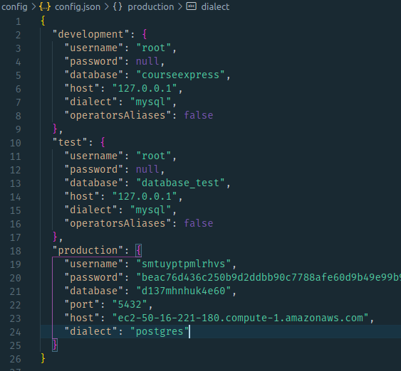
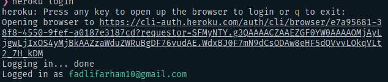
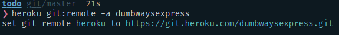
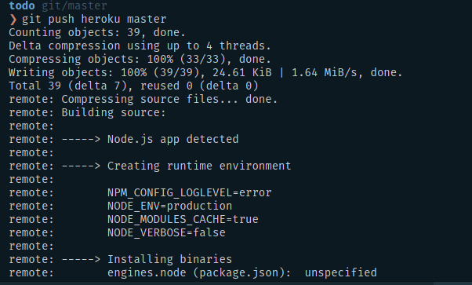

# Deploy Project ke Heroku

1. Clone Repository

2. Ganti Config Database

    

3. Login pada heroku 

    

4. Tambahkan branch heroku

    

5. Commit dan Push pada branch heroku

    

6. Done

    https://dumbwaysexpress.herokuapp.com/